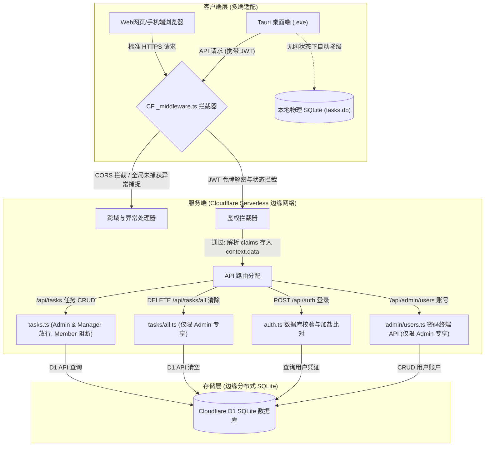

# PANN Task Manager (任务及稿费统计管理系统)

[](https://react.dev/)
[](https://tauri.app/)
[](https://pages.cloudflare.com/)
[-blueviolet?logo=sqlite&logoColor=white)](https://developers.cloudflare.com/d1/)
[](https://www.typescriptlang.org/)

**PANN Task Manager** 是一款面向内容制作团队、摄影俱乐部以及独立自由职业者的**多端智能任务与稿费统计管理系统**。

系统采用创新的**多端协同架构**，全面适配 Windows 桌面端应用（基于 Tauri）以及 Web/移动手机端（基于 Cloudflare Pages 部署）。系统支持“云端数据实时共享”与“本地单机离线运行”双重模式，并拥有精美的玻璃拟态（Glassmorphism）暗黑美学 UI 设计与高度完善的安全鉴权机制。

---

## 🌟 核心特性

*   **📱 跨端跨平台适配**：
    *   **桌面客户端 (Windows)**：基于 Tauri 2.x 原生编译，包体积极小（约 3.9MB 安装包），内存占用极低，集成系统原生通知与本地独立 SQLite。
    *   **Web 网页与移动端**：适配 iOS/Android 移动端屏幕，提供自适应侧边抽屉式导航与全面流畅的手势响应。
*   **🔄 云端同步与离线降级双路由**：
    *   **在线云端模式**：所有终端实时与 Cloudflare D1 边缘数据库同步，满足多人协同录入、实时统计与统计大盘共享的需求。
    *   **离线单机模式**：Tauri 客户端在无网或未配服务器时，自动无缝切换至本地物理 SQLite 数据库（`tasks.db`）独立运行。
*   **🔒 工业级加盐哈希与 JWT 动态鉴权**：
    *   **动态多用户隔离**：彻底摆脱静态全局密码限制，支持为团队中无限个不同成员分配独立的用户名与密码。
    *   **PBKDF2 金融级防爆破存储**：云端拒绝存储任何明文密码。密码在入库前自动由 Web Crypto 引擎结合随机盐（`salt`）进行 **100,000次 PBKDF2-SHA256 加盐迭代哈希运算**。
    *   **无感登录与 Token 过期机制**：用户登录通过后，单次签发 12 小时有效期的临时 JWT 会话令牌。前端在 API 通信中仅传递该 JWT，在保障安全的同时实现 localStorage 零密码泄露。
    *   **可视化“密码管理终端”与角色权限矩阵 (v1.1.2 升级版)**：
        *   **超级管理员 (Admin)**：在【设置】页面独享“密码管理终端”和“本地 SQLite 数据库”卡片。支持动态添加/禁用用户账号、重置密码、以及整库清空等底层运维操作。
        *   **数据管理 (Manager) [新增]**：专为业务主管打造的协作角色。在【任务列表】页面拥有与 Admin 完全相同的任务编辑、单条删除、Excel/TXT 批量导入和批量更新删除权限；但在【系统设置】页面中完全隐藏“用户与密码管理终端”与“本地 SQLite 数据库”卡片，保障账户大盘及数据库底座的绝对安全。
        *   **普通摄影师 (Member)**：极简只读/防误触安全隔离。登录后不仅限制写操作，前端还会在 DOM 中物理选择性移除所有添加、编辑、导入、导出、批量多选及操作列。设置页面仅限切换语言与主题，隐藏所有账号及数据库管理控制，且服务端 API 会对 member 的写入请求执行严格鉴权阻断（返回 403 Forbidden），确保数据大盘防篡改、防误触。
*   **📊 强大的数据导入导出引擎**：
    *   **Excel 智能导入**：支持识别格式混乱的外部表格，智能提取“任务名称”、“拍摄人”、“任务类型”、“任务日期”与“稿费”等关键维度。
    *   **物理文本清洗规则 (DRY 业务服务)**：支持在入库前自动对拍摄人后缀（如“（修图）”、“(修图)”）和地点拆分规则进行规范化清洗，确保大盘统计维度绝对纯净。
    *   **Excel 高级导出**：支持按照模板导出带有求和公式、边框样式及表头标题之专业稿费汇总单，并支持一键为特定摄影师生成个人对账单。
*   **🌗 现代玻璃拟态与极客双语排版系统**：
    *   **超感玻璃卡片质感**：基于 Tailwind CSS + Shadcn UI 深度定制的暗黑玻璃透光美学，在 v1.1.2 中深度重构 `.bg-card`，将背景模糊提升至 `blur(20px)`，在亮色模式下融入 slate-200 描边，使毛玻璃卡片拥有真实厚重的高级透光折射感。
    *   **IBM Plex Sans 双语排版**：引入 Google Fonts 预连接并配置 **IBM Plex 无衬线双语排版系统**。英文与数字优先渲染为极简精细的 `IBM Plex Sans`（长串对账金额排列极为整齐），中文回落至 `IBM Plex Sans SC`（简体中文），大幅优化视觉体验。
    *   **移动端自适应重构 (v1.1.2 Premium 级响应式优化)**：彻底解决移动端小屏幕下列宽受限、文字被迫换行、数据列堆叠截断、以及报表导出按钮严重挤压的体验痛点。
        *   **【系统设置】自适应重构**：表单在小屏下从原本的 3 列强行网格自动转换为单列自适应纵向排布 (`grid-cols-1 sm:grid-cols-3`)；用户账号表格彻底隐退，自动替换为**极简自适应玻璃卡片账户列表** (`block sm:hidden`)，以圆形的启用/禁用及密码重置玻璃按钮保证全屏触控顺滑。
        *   **【数据统计】Bento 微件化重构 (`stats.tsx`)**：
            1.  **每周任务统计**：在移动端抛弃扁平 Row Flex 结构，头部周区间与 Chevron 折叠箭头两端对齐，下方采用双列 **Bento-style 玻璃药丸微件网格**（左列 `FileText` 任务数，右列 `YuanIcon` 总支出），底部配备 100% 全宽大面积圆角导出按钮，极致防误触。点击展开周明细后，内嵌 Table 自适应转换为磨砂微型任务卡片栈，每个任务项均配备独立的 Camera（拍摄人）与 Calendar（日期）双列 Bento 水平小药丸。
            2.  **每月任务统计**：小屏下彻底隐藏表格，封装为月份卡片序列，内置四色 **2×2 四宫格自适应 Bento 数据板**：总任务（`Briefcase`，深海蓝）、计发稿费（`YuanIcon`，翡翠绿）、重大任务（`Layers`，玫瑰红）以及非重大任务（`FileText`，灰蓝）。
            3.  **摄影师月度稿费统计**：隐退长表格，转换为精美排行卡片列表。首三名独享 🥇、🥈、🥉 等尊贵奖牌微章，右上角以高亮翡翠绿大字突出应得总稿费。卡片底部并排两个 Bento 小药丸：参与任务数（`Briefcase`）与**稿费占比（`PieChart` 饼图图标，完美替换原有的易误导之趋势箭头）**，直观传达静态比例关系。

---

## 📐 系统架构拓扑图



---

## 📂 项目目录结构说明

```
f:\PANN\任务稿费统计/
├── functions/                  # Cloudflare Pages Serverless 后端 API
│   ├── api/
│   │   ├── _middleware.ts      # [核心] 全局中间件 (CORS 预检、JWT 拦截校验、全局 Try-Catch)
│   │   ├── auth.ts             # 升级为 POST 登录，实现动态凭证校验与冷启动自愈
│   │   ├── tasks.ts            # 任务增删改查路由 (直接受 JWT 保护，剥离 CORS)
│   │   ├── tasks/
│   │   │   └── all.ts          # 专属清空数据库接口 (仅管理员 JWT 可调用)
│   │   ├── admin/
│   │   │   └── users.ts        # [新增] 密码终端账户管理接口 (超级管理员专享 CRUD)
│   │   └── jwt.ts              # [工具] 原生 JWT 签名类与 PBKDF2 CryptoEngine 加密类
├── src/                        # 前端 React 源码
│   ├── assets/                 # 静态图片资源 (Logo 等)
│   ├── components/
│   │   ├── login-gate.tsx      # 用户名+密码登录门禁 (包含 JWT 自动校验与本地单机切换)
│   │   ├── layout.tsx          # 玻璃美学外壳 (集成自适应移动端 Hamburger 侧抽屉菜单)
│   │   └── ui/                 # 基础原子化 UI 组件 (Shadcn UI / Tailwind)
│   ├── lib/
│   │   ├── db.ts               # [核心] 统一数据库分流路由器 (自动判断云端/本地运行环境)
│   │   └── excelEngine.ts      # 智能 Excel 导入/解析及 Blob 导出引擎
│   ├── pages/                  # 业务功能页面
│   │   ├── dashboard.tsx       # 任务及稿费数据可视化主面板
│   │   ├── tasks.tsx           # 任务列表与录入 (自动根据角色过滤删除/批量操作)
│   │   ├── stats.tsx           # 每月稿费明细与摄影师统计大盘
│   │   └── settings.tsx        # 系统设置 (新增可视化“密码管理终端”管理特权卡片)
│   ├── App.tsx                 # 主入口 (封装门禁与全局路由)
│   └── index.css               # 主样式系统设计 (CSS Tokens)
├── src-tauri/                  # Tauri 2.x 桌面原生配置与 Rust 核心代码
├── index.html                  # 网页主入口模板
├── package.json                # 项目依赖管理
├── schema.sql                  # Cloudflare D1 数据库初始化 DDL 脚本
└── README.md                   # 本说明文件
```

---

## 💾 数据库表结构设计 (schema.sql)

系统数据库包含任务记录表 `TaskRecord` 与用户凭证表 `UserCredential`：

```sql
-- 1. 任务及稿费记录表
CREATE TABLE IF NOT EXISTS TaskRecord (
  id INTEGER PRIMARY KEY AUTOINCREMENT,      -- 自增主键 ID
  title TEXT NOT NULL,                        -- 任务/项目名称 (入库自动剔除地点后缀)
  photographer TEXT NOT NULL DEFAULT '',     -- 拍摄人/修图人名称 (入库自动净化修图后缀)
  taskType TEXT NOT NULL DEFAULT '非重大',    -- 任务类型 (如: 重大、非重大、特约)
  taskDate TEXT NOT NULL DEFAULT '',         -- 任务发生日期 (格式: YYYY-MM-DD)
  fee REAL NOT NULL DEFAULT 0                -- 稿费金额 (浮点型数)
);

-- 2. 用户凭证与权限角色表
CREATE TABLE IF NOT EXISTS UserCredential (
  username TEXT PRIMARY KEY,                  -- 用户名 (唯一主键)
  password_hash TEXT NOT NULL,                -- 经过加盐哈希加密后的密码密文 (PBKDF2/SHA-256)
  salt TEXT NOT NULL,                         -- 随机生成的加密盐值，防彩虹表破解
  role TEXT NOT NULL DEFAULT 'member',        -- 权限角色: 'admin' (管理员) 或 'member' (成员)
  created_at INTEGER NOT NULL,                -- 账号创建时间戳
  is_active INTEGER NOT NULL DEFAULT 1        -- 账号状态: 1 (启用), 0 (禁用)
);

-- 建立覆盖索引，大幅提升大盘渲染速度与鉴权过滤效率
CREATE INDEX IF NOT EXISTS idx_user_status ON UserCredential(username, is_active);
CREATE INDEX IF NOT EXISTS idx_task_date ON TaskRecord(taskDate);
CREATE INDEX IF NOT EXISTS idx_photographer ON TaskRecord(photographer);
```

---

## 🛠️ 本地开发指南

### 1. 开发环境前置要求
*   **Node.js**：v18.0.0 以上 (推荐 v22)
*   **Rust**：推荐安装 Rustc & Cargo (如果您需要重构并编译 Tauri 桌面应用)

### 2. 初始化项目依赖
克隆项目到本地后，在根目录下执行：
```bash
npm install
```

### 3. 运行前端开发服务器 (Vite)
如果您只想调试前端 UI，可直接运行：
```bash
npm run dev
```

### 4. 运行 Serverless 后端模拟器 (Cloudflare Wrangler)
本项目的 Serverless API 依赖于 Cloudflare 环境。要在本地同时模拟前端、Functions 路由以及本地 D1 数据库，可利用 Wrangler CLI：
```bash
# 启动本地模拟环境 (Vite 静态文件 + D1 数据库 + Pages API 连通)
npx wrangler pages dev dist --compatibility-date=2026-05-28 --d1=DB
```

### 5. 运行 Tauri 桌面开发模式
若想在桌面 webview 沙盒内进行实时联调，可运行：
```bash
npm run tauri dev
```

---

## 🌐 生产部署与上线说明 (Cloudflare Pages)

本系统可以完全托管在 Cloudflare 平台，实现全网极速低延迟部署与接近**永久免费**的日常开销。

### 第一步：创建并初始化 D1 数据库
1.  登录您的 [Cloudflare 控制台](https://dash.cloudflare.com/)。
2.  在左侧导航栏选择 **Workers & Pages > D1**，点击 **Create database**，创建一个名为 `pann-tasks-db` 的数据库。
3.  数据库创建成功后，进入其详情页，点击右上角的 **Console** (SQL 终端)。
4.  将本项目根目录下的 [schema.sql](file:///f:/PANN/任务稿费统计/schema.sql) 文件中的数据表与索引建表 SQL 完整复制到 Console 中并点击 **Execute** 运行，完成数据表初始化。

### 第二步：部署 Cloudflare Pages
1.  将您的本地代码推送至您的私有 GitHub 仓库。
2.  在 Cloudflare 控制台选择 **Workers & Pages > Create application > Pages > Connect to Git**，选择您的仓库。
3.  在构建配置中选择：
    *   **Framework preset**：`Vite`
    *   **Build command**：`npm run build`
    *   **Build output directory**：`dist`
4.  点击 **Save and Deploy** 开始初次编译上线。

### 第三步：配置绑定与安全密钥 (关键步骤)
为确保云端 API 连通与系统安全，需要在 Pages 的控制台进行如下设置：
1.  **D1 数据库绑定**：
    *   进入您的 Pages 项目，点击 **Settings > Functions**。
    *   在 **D1 database bindings** 区域点击 **Add binding**。
    *   **Variable name (变量名)**：必须填 `DB`。
    *   **D1 database**：选择第一步中创建的 `pann-tasks-db`。
2.  **配置系统安全密钥 (Environment variables)**：
    *   点击 **Settings > Environment variables**。
    *   添加如下变量值：
        *   `API_PASSWORD`：管理员初始化密码 (如果不配，默认冷启动密码为 `admin123`)。
        *   `MEMBER_PASSWORD`：普通成员初始化密码 (如果不配，默认冷启动密码为 `member123`)。
        *   `JWT_SECRET`：**【强烈建议配置】** 足够长且随机的强密钥串，用于服务端对 JWT 会话进行不可逆加密签名。
3.  保存配置后，在 **Deployments** 页面选择最新一次部署，点击 **Manage deployment > Redeploy** 重新部署以激活上述绑定。

### 🌟 首次登录自动冷启动初始化 (自愈上线)
由于初次部署时用户表完全为空，系统会自动拦截并执行“自愈自建”冷启动：
1.  使用最新版客户端，连接您的云端域名。
2.  **用户名** 输入 `admin`。
3.  **访问密码** 输入您在 Cloudflare 环境变量中配置的 `API_PASSWORD`。
4.  点击登录。系统通过匹配环境校验，并在通过的瞬间**自动在云端 UserCredential 表中写入加盐加密过的 `admin` 与 `member` 默认账户记录**。此后，您就可以安全地在系统【设置】页面中动态管理、新增团队账号和密码了！

---

## 📦 Tauri 桌面客户端编译发布

如果您对前端代码进行了任何定制，或者同步了上述重构升级，需要重新编译生成 Windows 原生软件：

```bash
# 启动 Tauri 高级自动打包构建
npm run tauri build
```
编译完成后，安装程序和免安装二进制文件将自动输出在：
*   `src-tauri/target/release/bundle/nsis/PANN Task Manager_1.1.2_x64-setup.exe` (自动复制并同步至您的项目根目录下)
*   `src-tauri/target/release/tauri-app.exe` (自动重命名为 `PANN Task Manager.exe` 同步至根目录下)

---

## 🔒 许可证

本项目基于 MIT 许可证开源。仅供内部团队管理及个人统计核算使用，请勿用于非法商业销售。
